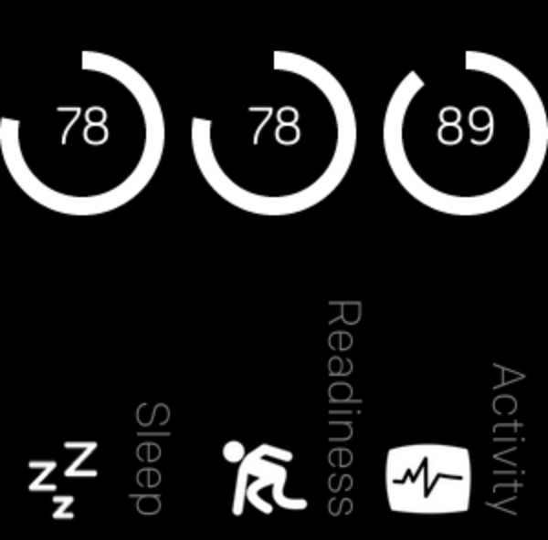

# Display your OuraRing stats on your Fitbit Versa

This app allows you to glance at your daily OuraRing summary scores from your Fitbit Versa. The app displays the scores for last night's sleep & readiness along with the current days activity.

## Getting started:

### Installation
The app hasn't been fully released yet but a [private version can be installed from the Fitbit App Gallery](https://gam.fitbit.com/gallery/app/2adcf708-953d-4fc0-a702-65c78702ac3b). Open [`https://gam.fitbit.com/gallery/app/2adcf708-953d-4fc0-a702-65c78702ac3b`](https://gam.fitbit.com/gallery/app/2adcf708-953d-4fc0-a702-65c78702ac3b) on your phone to launch the Fitbit app tjhere and install the OuraRing app.

### Setup
To get started you have to authorize this app to access your Oura daily summary data in the settings when installing this application. From the on your current Oura data will be loaded when starting the app on your Versa.

## Contributing & Building it yourself
You can use all of the code here to build your own version of the OuraRing Display. The only thing you have to do is to make sure you specify your own `CLIENT_ID` & `CLIENT_SECRET` for the OuraRing API. You can create these by going to [`https://cloud.ouraring.com/docs/`](https://cloud.ouraring.com/docs/) and logging in with your own OuraRing account. You can then create your own OuraRing API application.

Once that is done you can add your `CLIENT_ID` & `CLIENT_SECRET` to the `companion/secrets.js` file.

## Bugs
This is an extremely early version of the Oura data display, so there will be some bugs left. One known bug: Some data can not be displayed if it is already past midnight but you haven't slept yet. Also: Sometimes the Oura integration takes some time to actually display data, leading to missing activity data. Also: Make sure you have recently synchronized your OuraRing through their app to have the latest data.

Please report bugs you find or even better: fix them and make a pull request! 😉

## Disclaimer
This code has been adapted from Fitbit's [`https://github.com/Fitbit/sdk-oauth/`](https://github.com/Fitbit/sdk-oauth/) repository that highlights how to use their OAuth settings etc. This app is developed independently of the company behind the OuraRing, it's just a fan service by someone who likes both Fitbit & Oura's hardware.

### Terms of Service & Privacy Policy
This app does store and collect all data locally on your Fitbit device and your Fitbit companion app on your phone. The access credentials that are used to request your data from Oura are not sent to me, but are kept inside the Fitbit ecosystem.

During the installation through the Fitbit application this app requests Internet access permissions. These are exclusively used to access data from Oura. Only your latest scores for sleep, readiness & activity are used by these app to display it.
